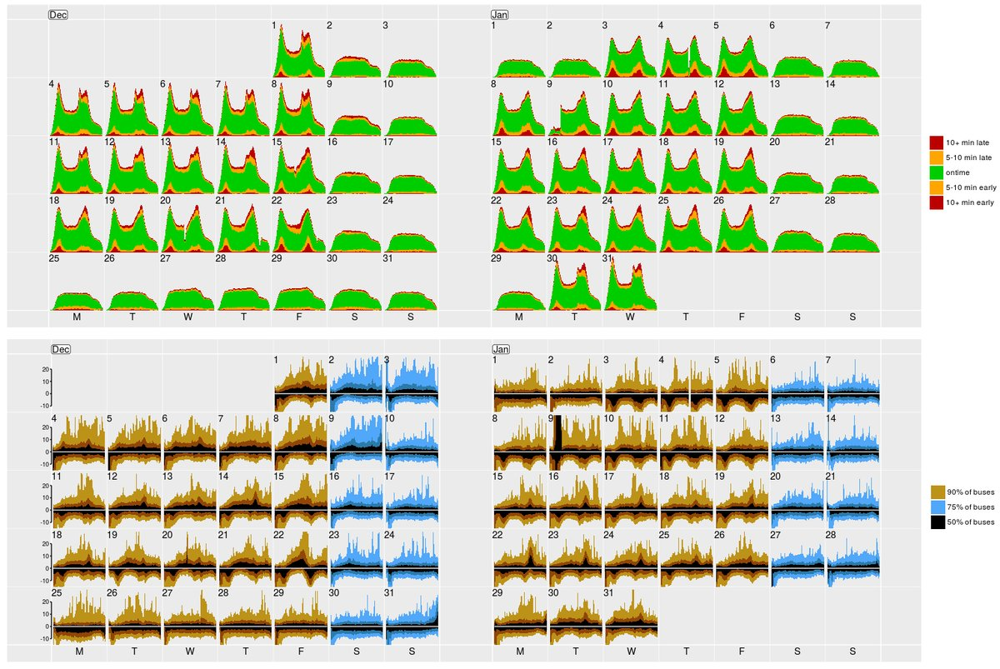

```{r initial, echo = FALSE, cache = FALSE, results = 'hide'}
library(knitr)
options(htmltools.dir.version = FALSE, tibble.width = 60, tibble.print_min = 10)
opts_chunk$set(
  echo = FALSE, warning = FALSE, message = FALSE, comment = "#>",
  fig.path = 'figure/', cache.path = 'cache/', fig.align = 'center', 
  fig.width = 12, fig.height = 11, fig.show = 'hold', 
  cache = TRUE, external = TRUE, dev = 'svglite'
)
read_chunk('src/code.R')
```

```{r load-pkgs}
```

```{r theme-remark}
```

class: middle

## What is temporal-context data?

**Data measured or collected at different time points**

--

## What to do with it?

* (1) trend, (2) seasonal variations, (3) outliers
* time dependencies within or cross series
* modeling and forecasting

---

class: bottom center

background-image: url(img/sensor.png)
background-size: 50%


# .blue[Melbourne pedestrian activity]

---

.left-column[
## Pedestrian counting system
### - sensors
]
.right-column[
## The city of Melbourne

```{r map, fig.height = 9}
```
```{r selected-sensor, fig.show = "hide"}
```
]

---

.left-column[
## Pedestrian counting system
### - sensors
### - the data
]
.right-column[
```{r ped-data}
```
```{r ped-print}
pedestrian
```
```{r ped-sub}
```

Sourced from [Melbourne open data portal](http://www.pedestrian.melbourne.vic.gov.au) <br>
Accessed through the [rwalkr](http://pkg.earo.me/rwalkr/) package
]

---

.left-column[
## Glimpse
### - selected sensors
]
.right-column[
* Flinders Street-Elizabeth Street (East)
* Southern Cross Station
* Victoria Market
```{r selected-sensor, fig.height = 9}
```
]

---

.left-column[
## Glimpse
### - selected sensors
### - time series plot
]
.right-column[
```{r ts-plot-na, echo = FALSE}
```
]

---

.left-column[
## Glimpse
### - selected sensors
### - time series plot
### - characteristics
]
.right-column[
* heterogenous data types
* multiple units (sensors)
* implicit missing values
```{r ts-plot-na, echo = FALSE}
```
]

---

## However ...

.pull-left[
### we have
.checked[
* heterogeneity
* explicitly declared time index
* implicit missing values
]
]
.pull-right[
### `ts`/`xts`/`zoo`
.x[
* homogeneity
* implicitly inferred time index
* explicit missing values
]
]

---

class: inverse middle center

.scale-up[]
## The future of time series in R

---

.left-column[

### - semantics
]
.right-column[
* **index**: an explicitly declared variable containing time indices.
* **key**: uniquely identifies each unit that measurements take place on over time.
* **interval**: a common time interval if data with regular time interval.
* arranged by key and index in ascending time order.
```{r tsibble, echo = TRUE}
```
]

---

.left-column[

### - semantics
### - turn implicit missingness to explicit
]
.right-column[
```{r fill-na, echo = TRUE}
```
]

---

.left-column[

### - semantics
### - turn implicit missingness to explicit
]
.right-column[
```{r ts-plot}
```
]

---

.left-column[

### - semantics
### - turn implicit missingness to explicit
### - aggregate over time
]
.right-column[
```{r tsummarise, echo = TRUE}
```
]

---

.left-column[

### - semantics
### - turn implicit missingness to explicit
### - aggregate over time
]
.right-column[
```{r daily-sensor}
```
]

---

.left-column[

### - semantics
### - turn implicit missingness to explicit
### - aggregate over time
### - dplyr verbs
]
.right-column[
```{r mutate, echo = TRUE}
```
]

---

.left-column[

### - semantics
### - turn implicit missingness to explicit
### - aggregate over time
### - dplyr verbs
]
.right-column[
```{r facet-time, echo = FALSE}
```
]

---

background-image: url(img/calendar.png)
background-size: cover

---

background-image: url(figure/sx-hol-1.svg)
background-size: cover

---

class: inverse middle center


## `r icon::fa_calendar()` calendar-based visualisation

---

## Calendar-based visualisation

.block[
.flowchart[
* `frame_calendar()` <br> re-structure into a calendar layout
]
]

```r
sx_cal <- pedestrian %>% 
  filter(Sensor == "Southern Cross Station") %>% 
* frame_calendar(x = Time, y = Count, date = Date)
```

```{r sx}
```

---

## Calendar-based visualisation

.block[
.flowchart[
* `frame_calendar()` <br> re-structure into a calendar layout
* `ggplot()` <br> synchronize with grammar of graphics
]
]

```r
p_sx <- sx_cal %>% 
* ggplot(aes(x = .Time, y = .Count, colour = Holiday, group = Date)) +
* geom_line()
```
```{r sx-plot, fig.height = 9}
```

---

## Calendar-based visualisation

.block[
.flowchart[
* `frame_calendar()` <br> re-structure into a calendar layout
* `ggplot()` <br> synchronize with grammar of graphics
* `prettify()` <br> add reference lines and labels
]
]
```r
* prettify(p_sx)
```
```{r sx-prettify, fig.height = 9.5}
```

---

.left-column[
## Special events
### - adele's concert
]
.right-column[
## Southern Cross Station
```{r sx-march}
```
]

---

.left-column[
## Special events
### - adele's concert
]
.right-column[

]

---

.left-column[
## Special events
### - adele's concert
### - car attack
]
.right-column[
## Flinders St-Elizabeth St
```{r dec}
```
]

---

.left-column[
## Special events
### - adele's concert
### - car attack
]
.right-column[

[Wikipedia: December 21 2017 Melbourne car attack](https://en.wikipedia.org/wiki/December_2017_Melbourne_car_attack)
.footnote[picture: <a href="/wiki/User:Dysprosia~commonswiki" class="mw-redirect" title="User:Dysprosia~commonswiki">Dysprosia</a> [<a href="http://opensource.org/licenses/bsd-license.php">BSD</a>], <a href="https://commons.wikimedia.org/wiki/File%3AElizabeth_Street_tram_terminus%2C_Melbourne.jpg">via Wikimedia Commons</a>]
]

---

.left-column[
## Showcases
### - electricity consumption
]
.right-column[

.red[.footnote[Reference: **Roach, C** (forthcoming 2018). Assessing the impact of building characteristics on energy consumption using semiparametric mixed models.]]
]

---

.left-column[
## Showcases
### - electricity consumption
### - bus delays
]
.right-column[
<br>
<br>
<br>

.red[.footnote[Reference: [Tom Elliott's tweet](https://twitter.com/tomelliottnz/status/958887861943640064)]]
]

---

class: inverse middle center

# Wrap-up

---

## Data science pipeline

<br>
<br>


.footnote[adapted from [r4ds](http://r4ds.had.co.nz/explore-intro.html)]

---

class: inverse middle center

### Slides created via xaringan `r emo::ji("crossed_swords")` <http://slides.earo.me/bonjour>

--
### Open source <https://github.com/earowang/bonjour>

--
### This work is under licensed [`r icon::fa("creative-commons")` BY-NC 4.0](https://creativecommons.org/licenses/by-nc/4.0/).

--

### Thank you!

--

### .

--

### .

--

### .

--

### FIN
